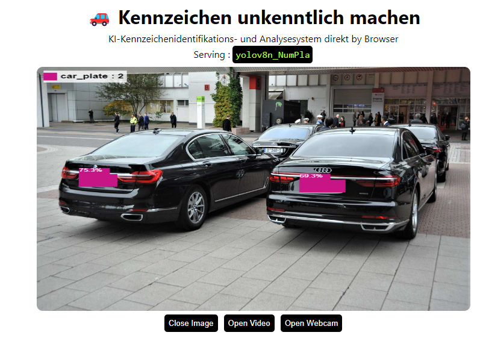
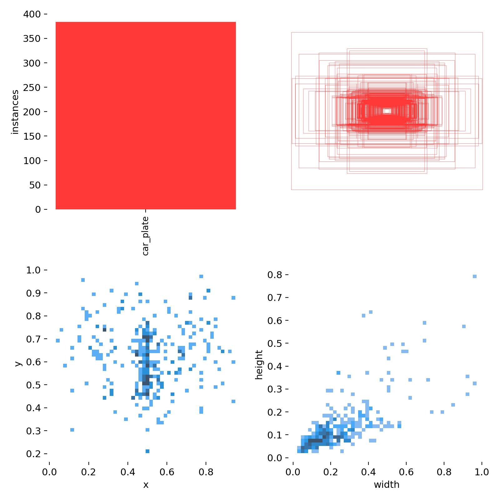
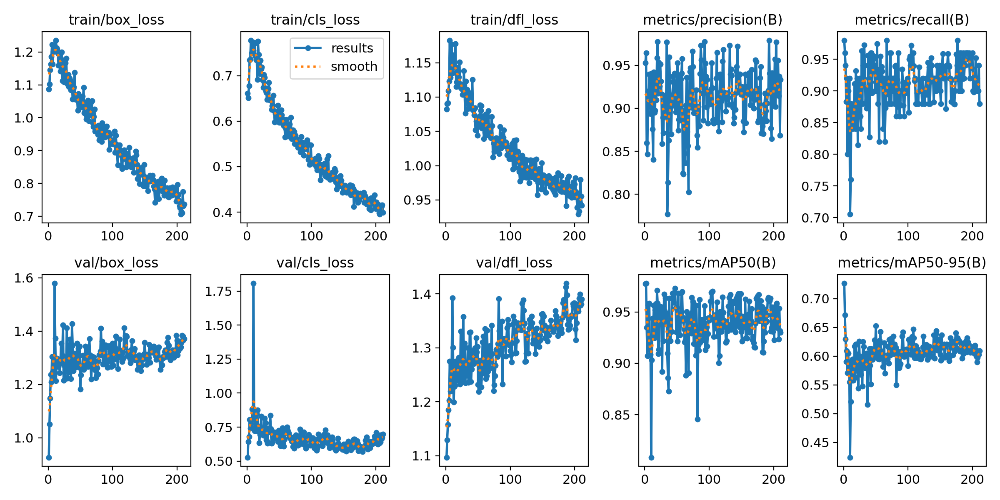
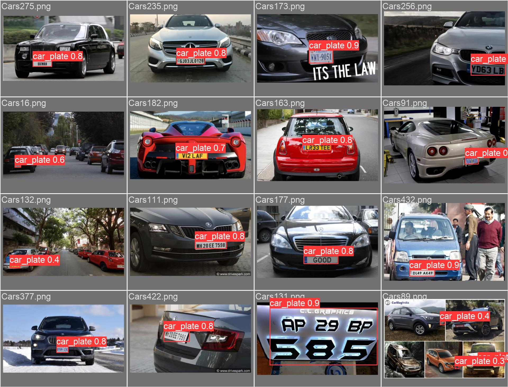
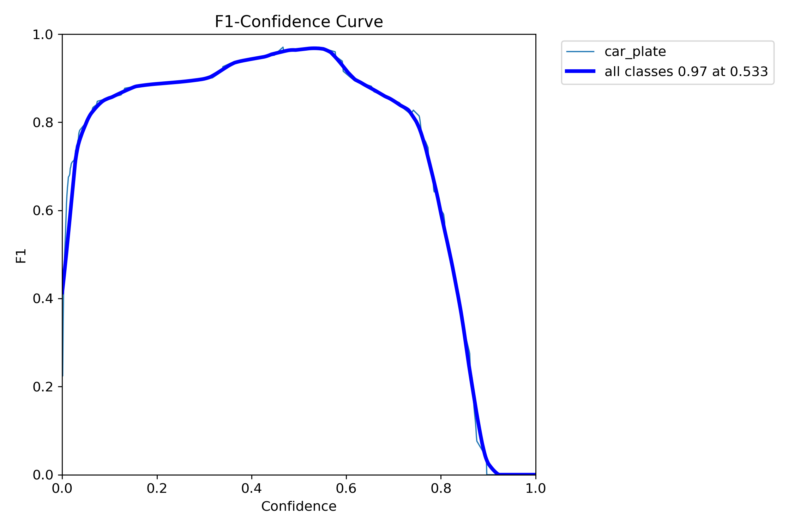

# 🚗 Kennzeichen unkenntlich machen

  

---
Über den folgenden Link können Sie Ihre Bilder oder Videos direkt hochladen und testen, sogar Live-Videos von Ihrer Kamera können getestet werden.

Through the link below, you can directly upload and test your images or videos, even test video streams from your camera.

**KI-Kennzeichenidentifikations- und Analysesystem direkt by Browser**

Link: https://miaoima.github.io/Blurry_NumPlate/
---
### DE：
---
### Projektzweck und Anforderungen:
Dieses Projekt zielt darauf ab, mögliche Datenschutzprobleme in öffentlich zugänglichen Bildern oder Videos zu lösen, insbesondere im Umgang mit Kfz-Kennzeichen. Aufgrund von Datenschutzerwägungen muss das Projekt Kfz-Kennzeichen in Bildern oder Videos identifizieren und verdecken, um zu verhindern, dass persönliche Informationen öffentlich zugänglich gemacht werden.

### Projektumsetzung und -methoden:
Dieses Projekt basiert auf dem Netzwerkrahmen des yolov8n-Modells und realisiert durch Tiefenlernen und Bildverarbeitungstechnologien die automatische Identifikation und Verdeckung von Kfz-Kennzeichen. Die spezifischen Schritte sind wie folgt:
1. **Modelltraining**: Das Modell wird mit einer großen Anzahl von Bildern, die Kfz-Kennzeichen enthalten, trainiert, um die Position der Kfz-Kennzeichen im Bild genau zu identifizieren.
2. **Verdeckung von Kfz-Kennzeichen**: Nachdem das Modell die Position des Kfz-Kennzeichens identifiziert hat, wird der Bereich des Kfz-Kennzeichens automatisch verdeckt, um zu verhindern, dass Informationen über das Kfz-Kennzeichen durchsickern.
3. **Automatisierung**: Der gesamte Identifikations- und Verdeckungsprozess wird automatisch abgeschlossen, ohne manuelle Intervention, was die Effizienz erheblich steigert.

### Bestehende Probleme und Verbesserungsrichtungen des Projekts:
Zurzeit gibt es ein Problem bei der Echtzeitausgabe von Videos im Projekt, nämlich dass die Verarbeitungsergebnisse und das Videobild nicht synchron sind, d.h. das Verdecken von Kfz-Kennzeichen ist langsamer als die Videowiedergabe. Auch wenn bereits das kleinste Modell, yolov8n, verwendet wird, besteht dieses Problem immer noch offensichtlich. Um dieses Problem zu lösen, könnte einerseits ein Frame-Cache hinzugefügt werden, der die verarbeiteten Frames zwischenspeichert und das Video erst nach Abschluss der Verarbeitung abspielt. Diese Verbesserung wird in zukünftigen Versionen in Betracht gezogen. Andererseits könnte das Modell auch direkt auf dem lokalen Computer verwendet und jedes Frame des Videos mit cv2 verarbeitet und dann das Video neu zusammengesetzt werden. Diese Methode wäre effizienter, besonders für Benutzer, die eine große Menge an Videos verarbeiten müssen, verglichen mit der Verwendung von Front-End-Technologien auf der Website.

### Projektbedeutung:
Durch die Umsetzung dieses Projekts können wir effektiv verhindern, dass persönliche Informationen durch die Veröffentlichung von Bildern oder Videos durchsickern. Es trägt dazu bei, das Vertrauen und die Zufriedenheit der Öffentlichkeit in Bezug auf den Schutz persönlicher Daten zu erhöhen, und entspricht auch den relevanten gesetzlichen und politischen Anforderungen.

### EN：
---
### Project Purpose and Requirements:
This project aims to address potential privacy concerns in publicly available images or videos, especially regarding vehicle license plates. Due to data protection considerations, the project is required to identify and obscure vehicle license plates in images or videos to prevent the exposure of personal information.

### Implementation and Methods:
This project, based on the yolov8n model network framework, realizes the automatic identification and obscuration of vehicle license plates through deep learning and image processing technologies. The specific steps are as follows:
1. **Model Training**: The model is trained with a large number of images containing vehicle license plates to accurately identify the location of the license plates in the image.
2. **License Plate Obscuration**: Once the model identifies the location of the license plate, the license plate area is automatically obscured to ensure the information is not leaked.
3. **Automation**: The entire identification and obscuration process is completed automatically, without manual intervention, greatly improving efficiency.

### Existing Problems and Improvements:
Currently, there is a synchronization issue in the project during the real-time output of videos; that is, the processing results and the video image are not synchronized, meaning the obscuration of the license plates is slower than the video playback. Even when using the smallest model, yolov8n, this problem is still apparent. To solve this problem, one approach is to add a frame cache to store the processed frames and play the video only after processing is completed. This improvement will be considered in subsequent versions. Another alternative is to use the model directly on a local computer, process each frame of the video with cv2, and then reassemble the video. This method is more efficient, especially for users who need to process a large number of videos, compared to using front-end technologies on the website.

### Significance of the Project:
Through the implementation of this project, we can effectively prevent the leakage of personal information due to the publication of images or videos. It helps to enhance public trust and satisfaction in personal data protection and also complies with relevant legal and policy requirements.

---

## Dataset

Das untenstehende Bild gibt einen Überblick über den Trainingsdatensatz. Obwohl die Anzahl der Bilder relativ gering ist, etwa nur 500, erfüllt das Vorhersageergebnis dennoch grundsätzlich unsere Anforderungen.

  

## Result

Bei Betrachtung der Vorhersageergebnisse stellen wir fest, dass das Modell im Großen und Ganzen unseren Erwartungen entspricht. Allerdings glauben wir, dass bei mehr Trainingsepochen der Verlust (Loss) noch weiter reduziert werden könnte, da er derzeit noch einen abnehmenden Trend aufweist.

  

  

  

## Reference

- https://github.com/ultralytics/ultralytics
- https://github.com/Hyuto/yolov8-onnxruntime-web

